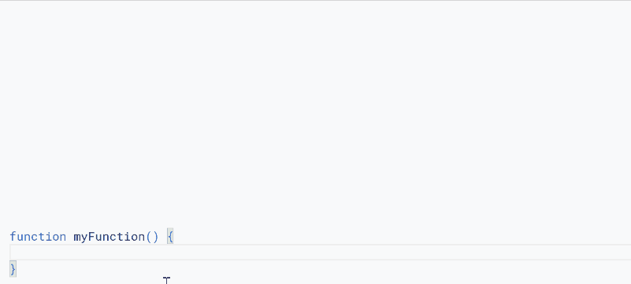

# UtlApp

<a name="top"></a>
[MIT License](LICENCE)

<a name="overview"></a>

# Overview

This is a Google Apps Script library including useful scripts for supporting to development of applications by Google Apps Script. In the current stage, the 3 categories "For array processing", "For binary processing", and "For string processing" are included in this library.


<a name="description"></a>

# Description

When I create applications using Google Apps Script, there are useful scripts for often use. At that time, I thought that when those scripts can be simply used, they will be useful not only to me but also to other users. From this motivation, I created a Google Apps Script library including those scripts. But, I have been using these useful scripts only in my development before.

I sometimes answer questions related to Google Apps Script at Stackoverflow. From my experience that I have answered those questions, I also added useful scripts, that I believe, in the library. Some of these scripts will be also the direct answer to the questions. If this was useful for your situation, I'm glad.

# Policy of this library

**The policy of this library is not to use any scopes.**

# Library's project key

```
1idMI9-WtPMbYvbK5D7KH2_GWh62Dny9RG8NzjwjHI5whGIAPXEtTJmeC
```

<a name="usage"></a>

# Usage

## 1. Install library

In order to use this library, please install the library as follows.

1. Create a GAS project.

   - You can use this library for the GAS project of both the standalone type and the container-bound script type.

1. [Install this library](https://developers.google.com/apps-script/guides/libraries).

   - Library's project key is **`1idMI9-WtPMbYvbK5D7KH2_GWh62Dny9RG8NzjwjHI5whGIAPXEtTJmeC`**.

# Methods

## For array processing

| Methods                                           | Description                                                                     |
| :------------------------------------------------ | :------------------------------------------------------------------------------ |
| [is2DimensionalArray](#is2dimensionalarray)       | When the inputted array is 2 dimensional array, true is returned.               |
| [isUniform2DArray](#isuniform2darray)             | When the inputted 2 dimensional array is the uniformed array, true is returned. |
| [uniform2DArray](#uniform2darray)                 | Make all array in 2 dimensional array uniforming the same length.               |
| [transpose](#transpose)                           | Transpose 2 dimensional array.                                                  |
| [splitArray](#splitarray)                         | Split array every n length.                                                     |
| [getSpecificColumns](#getspecificcolumns)         | Retrieve the specific columns from 2 dimensional array.                         |
| [deleteSpecificColumns](#deletespecificcolumns)   | Delete specific columns from 2 dimensional array.                               |
| [insertColumns](#insertcolumns)                   | Insert columns to 2 dimensional array.                                          |
| [removeDuplicatedValues](#removeduplicatedvalues) | Remove duplicated values from 1 dimensional array.                              |
| [get1stEmptyRow](#get1stemptyrow)                 | Retrieve empty row index.                                                       |
| [get1stEmptyColumn](#get1stemptycolumn)           | Retrieve empty column index.                                                    |
| [sum](#sum)                                       | Sum numbers in an array.                                                        |
| [compilingNumbers](#compilingnumbers)             | Compiling Continuous Numbers using Google Apps Script.                          |
| [convArrayToObject](#convarraytoobject)           | Converting 2 dimensional array to JSON object.                                  |
| [unpivot](#unpivot)                               | Converting 2-dimensional array as unpivot (reverse pivot).                      |
| [reverseUnpivot](#reverseunpivot)                 | Reversing 2-dimensional array with unpivot.                                     |
| [dotProduct](#dotproduct)                         | Calculate dot product from 2 arrays.                                            |
| [cosineSimilarity](#cosinesimilarity)             | Calculate cosine similarity from 2 arrays.                                      |

## For binary processing

| Methods                                                   | Description                                      |
| :-------------------------------------------------------- | :----------------------------------------------- |
| [convInt8ArrayToHexAr](#convint8arraytohexar)             | Convert Int8Array to hex string array.           |
| [convStrToHex](#convstrtohex)                             | Convert string to hex.                           |
| [convHexToInt8Ar](#convhextoint8ar)                       | Convert string to hex.                           |
| [convInt8ArToStr](#convint8artostr)                       | Convert Int8Array to string value.               |
| [convInt8ArToUint8Ar](#convint8artouint8ar)               | Convert Int8Array to Uint8Array.                 |
| [convUint8ArToInt8Ar](#convuint8artoint8ar)               | Convert Uint8Array to Int8Array.                 |
| [searchIndexFromDataByData](#searchindexfromdatabydata)   | Search index from base data using a search data. |
| [splitByteArrayBySearchData](#splitbytearraybysearchdata) | Split byteArray by a search data.                |
| [convertL16ToWav](#convertl16towav) | Converts a byte data of "audio/L16" to a byte data of "audio/wav".     |
| [getMP3Tag](#getmp3tag) | This method is used for retrieving the MP3 tag information.     |
| [getInfFromBlob](#getinffromblob) | This method returns the information of blob.     |

## For string processing

| Methods                                                 | Description                                                                      |
| :------------------------------------------------------ | :------------------------------------------------------------------------------- |
| [ConvText](#convtext)                                   | Converting text as unicode.                                                      |
| [columnLetterToIndex](#columnlettertoindex)             | Converting colum letter to column index. Start of column index is 0.             |
| [columnIndexToLetter](#columnindextoletter)             | Converting colum index to column letter. Start of column index is 0.             |
| [convA1NotationToGridRange](#conva1notationtogridrange) | Converting a1Notation to gridrange. This will be useful for using Sheets API.    |
| [convGridRangeToA1Notation](#convgridrangetoa1notation) | Converting gridrange to a1Notation. This will be useful for using Sheets API.    |
| [addQueryParameters](#addqueryparameters)               | This method is used for adding the query parameters to the URL.                  |
| [parseQueryParameters](#parsequeryparameters)           | This method is used for parsing the URL including the query parameters.          |
| [expandA1Notations](#expandA1Notations)                 | This method is used for expanding A1Notations.                                   |
| [consolidateA1Notations](#consolidatea1notations)       | This method is used for consolidating the scattered A1Notations.                 |
| [blobToDataUrl](#blobtodataurl)                         | This method is used for converting Blob to the data URL.                         |
| [snake_caseToCamelCase](#snakecasetocamelcase)          | This method is used for converting a string of the snake case to the camel case. |
| [camelCaseTosnake_case](#camelcasetosnakecase)          | This method is used for converting a string of the camel case to the snake case. |
| [createFormDataObject](#createformdataobject)           | This method is used for creating the form data to HTTP request from an object.   |

## Show document in script editor

When you use this library with the script editor of Google Apps Script, you can see the document of each method by the autocompletion of the script editor. You can see the following demonstration.



# Scripts of all methods

---

## For array processing

<a name="is2dimensionalarray"></a>

### is2DimensionalArray

When the inputted array is 2 dimensional array, true is returned.

````javascript
/**
 * ### Description
 * When the inputted array is 2 dimensional array, true is returned.
 *
 * ### Sample script
 * ```
 * const array1 = ["", [1, 2, 3], [1, 2, 3], [1, 2, 3]];
 * const res1 = UtlApp.is2DimensionalArray(array1); // false
 *
 * const array2 = [[1, 2, 3], [1, 2], [1]];
 * const res2 = UtlApp.is2DimensionalArray(array2); // true
 * ```
 *
 * @param {Array} array 2 dimensional array.
 * @return {Boolean} When the inputted array is 2 dimensional array, true is returned.
 */
function is2DimensionalArray(array) {
  return array.every((r) => Array.isArray(r));
}
````

<a name="isuniform2darray"></a>

### isUniform2DArray

When the inputted 2 dimensional array is the uniformed array, true is returned.

````javascript
/**
 * ### Description
 * When the inputted 2 dimensional array is the uniformed array, true is returned.
 *
 * ### Sample script
 * ```
 * const array1 = [[1, 2, 3], [1, 2, 3], [1, 2, 3]];
 * const res1 = UtlApp.isUniform2DArray(array1); // true
 *
 * const array2 = [[1, 2, 3], [1, 2], [1]];
 * const res2 = UtlApp.isUniform2DArray(array2); // false
 * ```
 *
 * @param {Array} array 2 dimensional array.
 * @param {Boolean} check Check whether the inputted array is 2 dimensional array. Default is true.
 * @return {Boolean} When the inputted 2 dimensional array is the uniformed array, true is returned.
 */
function isUniform2DArray(array, check = true) {
  if (check && !is2DimensionalArray(array)) {
    throw new Error("Please use 2 dimensional array.");
  }
  return new Set(array.map((r) => r.length)).size == 1 ? true : false;
}
````

<a name="uniform2darray"></a>

### uniform2DArray

Make all array in 2 dimensional array uniforming the same length.

````javascript
/**
 * ### Description
 * Make all array in 2 dimensional array uniforming the same length.
 *
 * ### Sample script
 * ```
 * const array1 = [[1, 2, 3], [1, 2, 3], [1, 2, 3]];
 * const res1 = UtlApp.uniform2DArray(array1);
 * console.log(res1); // [ [ 1, 2, 3 ], [ 1, 2, 3 ], [ 1, 2, 3 ] ]
 *
 * const array2 = [[1, 2, 3], [1, 2], [1]];
 * const res2 = UtlApp.uniform2DArray(array2);
 * console.log(res2); // [ [ 1, 2, 3 ], [ 1, 2, null ], [ 1, null, null ] ]
 * ```
 *
 * @param {Array} array 2 dimensional array.
 * @param {*} empty Value used in the added element. Default is null.
 * @param {Boolean} check Check whether the inputted array is 2 dimensional array. Default is true.
 * @return {Array} Uniformed array.
 */
function uniform2DArray(array, empty = null, check = true) {
  if (check && !is2DimensionalArray(array)) {
    throw new Error("Please use 2 dimensional array.");
  }
  const maxLen = Math.max(...array.map((r) => r.length));
  return array.map((r) => [...r, ...Array(maxLen - r.length).fill(empty)]);
}
````

<a name="transpose"></a>

### transpose

Transpose 2 dimensional array.

````javascript
/**
 * ### Description
 * Transpose 2 dimensional array.
 *
 * ### Sample script
 * ```
 * const array1 = [[1, 2, 3], [1, 2, 3], [1, 2, 3]];
 * const res1 = UtlApp.transpose(array1);
 * console.log(res1); // [ [ 1, 1, 1 ], [ 2, 2, 2 ], [ 3, 3, 3 ] ]
 *
 * const array2 = [[1, 2, 3], [1, 2], [1]];
 * const res2 = UtlApp.transpose(array2);
 * console.log(res2); // [ [ 1, 1, 1 ], [ 2, 2, null ], [ 3, null, null ] ]
 * ```
 *
 * @param {Array} array 2 dimensional array.
 * @param {Boolean} check Check whether the inputted array is 2 dimensional array. Default is true.
 * @return {Array} Transposed array.
 */
function transpose(array, check = true) {
  if (check && !is2DimensionalArray(array)) {
    throw new Error("Please use 2 dimensional array.");
  }
  return array[0].map((_, col) => array.map((row) => row[col] || null));
}
````

<a name="splitarray"></a>

### splitArray

Split array every n length. [Ref](https://tanaikech.github.io/2022/05/21/splitting-and-processing-an-array-every-n-length-using-google-apps-script/)

````javascript
/**
 * ### Description
 * Split array every n length.
 * Ref: https://tanaikech.github.io/2022/05/21/splitting-and-processing-an-array-every-n-length-using-google-apps-script/
 *
 * ### Sample script
 * ```
 * const size = 3;
 * const array1 = ["a1", "b1", "c1", "d1", "e1", "f1", "g1", "h1", "i1", "j1"];
 * const res = UtlApp.splitArray(array1, size);
 * console.log(res);
 * ```
 *
 * Result is as follows.
 *
 * ```
 * [
 *   [ 'a1', 'b1', 'c1' ],
 *   [ 'd1', 'e1', 'f1' ],
 *   [ 'g1', 'h1', 'i1' ],
 *   [ 'j1' ]
 * ]
 * ```
 *
 * @param {Array} array 2 dimensional array.
 * @param {Boolean} check Check whether the inputted array is 2 dimensional array. Default is true.
 * @return {Array} Transposed array.
 */
function splitArray(array, size) {
  if (!array || !size || !Array.isArray(array)) {
    throw new Error("Please give an array and split size.");
  }
  return [...Array(Math.ceil(array.length / size))].map((_) =>
    array.splice(0, size)
  );
}
````

<a name="getspecificcolumns"></a>

### getSpecificColumns

Retrieve the specific columns from 2 dimensional array.

````javascript
/**
 * ### Description
 * Retrieve the specific columns from 2 dimensional array.
 *
 * ### Sample script
 * ```
 * const array1 = [[1, 2, 3], [1, 2, 3], [1, 2, 3]];
 * const columns = [2];
 * const res = UtlApp.getSpecificColumns(array1, columns);
 * console.log(res); // [ [ 2 ], [ 2 ], [ 2 ] ]
 * ```
 *
 * @param {Array} array 2 dimensional array.
 * @param {Array} columns 1 dimensional array. Give the specific column numbers you want to get. The 1st number is 1.
 * @param {Boolean} check Check whether the inputted array is 2 dimensional array. Default is true.
 * @return {Array} Retrieved specific columns.
 */
function getSpecificColumns(array, columns, check = true) {
  if (check && !is2DimensionalArray(array)) {
    throw new Error("Please use 2 dimensional array.");
  }
  if (!columns || !Array.isArray(columns) || columns.length == 0) {
    throw new Error("Please set column numbers you want to retrieve.");
  }
  return array.map((r) => columns.map((e) => r[e - 1] || null));
}
````

<a name="deletespecificcolumns"></a>

### deleteSpecificColumns

Delete specific columns from 2 dimensional array.

````javascript
/**
 * ### Description
 * Delete specific columns from 2 dimensional array.
 *
 * ### Sample script
 * ```
 * const array1 = [[1, 2, 3], [1, 2, 3], [1, 2, 3]];
 * const columns = [2];
 * const res = UtlApp.deleteSpecificColumns(array1, columns);
 * console.log(res); // [ [ 1, 3 ], [ 1, 3 ], [ 1, 3 ] ]
 * ```
 *
 * @param {Array} array 2 dimensional array.
 * @param {Array} columns 1 dimensional array. Give the specific column numbers you want to delete. The 1st number is 1.
 * @param {Boolean} check Check whether the inputted array is 2 dimensional array. Default is true.
 * @return {Array} Array deleted the specific columns.
 */
function deleteSpecificColumns(array, columns, check = true) {
  if (check && !is2DimensionalArray(array)) {
    throw new Error("Please use 2 dimensional array.");
  }
  if (!columns || !Array.isArray(columns) || columns.length == 0) {
    throw new Error("Please set column numbers you want to retrieve.");
  }
  return array.map((r) => r.filter((_, j) => !columns.includes(j + 1)));
}
````

<a name="insertcolumns"></a>

### insertColumns

Insert columns to 2 dimensional array.

````javascript
/**
 * ### Description
 * Insert columns to 2 dimensional array.
 *
 * ### Sample script
 * ```
 * const array1 = [[1, 2, 3], [1, 2, 3], [1, 2, 3]];
 * const array2 = [[4, 5, 6], [7, 8, 9]];
 * const column = 2;
 * const res1 = UtlApp.insertColumns(array1, array2, column);
 * console.log(res1); // [[1,4,5,6,2,3],[1,7,8,9,2,3],[1,null,null,null,2,3]]
 *
 * const res2 = UtlApp.insertColumns(array1, array2, column, true);
 * console.log(res1); // [[1,4,5,6,2,3],[1,7,8,9,2,3],[1,null,null,null,2,3]]
 * ```
 *
 * @param {Array} array 2 dimensional array.
 * @param {Array} insertArray 2 dimensional array you want to insert.
 * @param {Number} column Column number you want to insert the array. The 1st number is 1. Default is 1.
 * @param {Boolean} rep When you want to replace the column, please use true. Default is false. In this case, the columns are inserted.
 * @param {Boolean} check Check whether the inputted array is 2 dimensional array. Default is true.
 * @return {Array} Array inserted the columns.
 */
function insertColumns(
  array,
  insertArray,
  column = 1,
  rep = false,
  check = true
) {
  if (check && !is2DimensionalArray(array)) {
    throw new Error("Please use 2 dimensional array.");
  }
  if (
    !insertArray ||
    !Array.isArray(insertArray) ||
    insertArray.length == 0 ||
    !is2DimensionalArray(insertArray)
  ) {
    throw new Error("Please set columns you want to insert.");
  }
  const t = transpose(array, false);
  t.splice(column - 1, rep ? 1 : 0, ...transpose(insertArray, false));
  return transpose(t, false);
}
````

<a name="removeduplicatedvalues"></a>

### removeDuplicatedValues

Remove duplicated values from 1 dimensional array.

````javascript
/**
 * ### Description
 * Remove duplicated values from 1 dimensional array.
 *
 * ### Sample script
 * ```
 * const array1 = ["a1", "b1", "c1", "b1", "c1"];
 * const res = UtlApp.removeDuplicatedValues(array1);
 * console.log(res);
 * ```
 *
 * Result is as follows.
 *
 * ```
 * {
 * "removeDuplicatedValues":["a1","b1","c1"],
 * "duplicatedValues":["b1","c1"],
 * "numberOfDuplicate":{"a1":1,"b1":2,"c1":2}
 * }
 * ```
 *
 * @param {Array} array 1 dimensional array.
 * @return {Object} Object including removeDuplicatedValues, duplicatedValues and numberOfDuplicate.
 */
function removeDuplicatedValues(array) {
  if (!Array.isArray(array)) {
    throw new Error("Please use 1 dimensional array.");
  }
  const obj = array.reduce(
    (m, e) => m.set(e, m.has(e) ? m.get(e) + 1 : 1),
    new Map()
  );
  const e = [...obj.entries()];
  return {
    removeDuplicatedValues: [...obj.keys()],
    duplicatedValues: e.reduce((ar, [k, v]) => {
      if (v != 1) ar.push(k);
      return ar;
    }, []),
    numberOfDuplicate: Object.fromEntries(e),
  };
}
````

<a name="get1stemptyrow"></a>

### get1stEmptyRow

Retrieve empty row index.

````javascript
/**
 * ### Description
 * Retrieve empty row index.
 *
 * ### Sample script
 * ```
 * const array1 = [["a1"], [2], [3], [4], [], [5], [], ["z"], [""], [7], [8]];
 * const res = UtlApp.get1stEmptyRow(array1);
 * console.log(res); // { topEmptyRow: 4, lastEmptyRow: 8 }
 * ```
 *
 * @param {Array} array 2 dimensional array.
 * @param {Boolean} check Check whether the inputted array is 2 dimensional array. Default is true.
 * @return {Object} Object including the top empty row index and the last empty row index.
 */
function get1stEmptyRow(array, check = true) {
  if (check && !is2DimensionalArray(array)) {
    throw new Error("Please use 2 dimensional array.");
  }
  return {
    topEmptyRow: array.findIndex((r) => r.join("") == ""),
    lastEmptyRow:
      array.length - 1 - array.reverse().findIndex((r) => r.join("") == ""),
  };
}
````

<a name="get1stemptycolumn"></a>

### get1stEmptyColumn

Retrieve empty column index.

````javascript
/**
 * ### Description
 * Retrieve empty column index.
 *
 * ### Sample script
 * ```
 * const array1 = [["a1", "b1", "f", "d1", "aa", "h", "aa"], [2, 3, 4, 5], [3, 1, 1, , , 3], [4, 1, 1, 1], [1, 2, 3], [5, 1, 1], [1, 1, 1], ["z", 1, 1], [1, "b", 1, 1, ""], [7, 1, 1, 1], [8, 6, 5, 4, 3]];
 * const res = UtlApp.get1stEmptyColumn(array1);
 * console.log(res); // { topEmptyColumn: 3, lastEmptyColumn: 7 }
 * ```
 *
 * @param {Array} array 2 dimensional array.
 * @param {Boolean} check Check whether the inputted array is 2 dimensional array. Default is true.
 * @return {Object} Object including the top empty column index and the last empty column index.
 */
function get1stEmptyColumn(array, check = true) {
  if (check && !is2DimensionalArray(array)) {
    throw new Error("Please use 2 dimensional array.");
  }
  return array.reduce(
    (o, r) => {
      let top = r.findIndex(
        (c) => typeof c === "undefined" || c.toString() == ""
      );
      let last =
        r.length -
        1 -
        r
          .reverse()
          .findIndex((c) => typeof c === "undefined" || c.toString() == "");
      top = top == -1 ? r.length : top;
      last = last == -1 ? 0 : last;
      o.topEmptyColumn = o.topEmptyColumn < top ? o.topEmptyColumn : top;
      o.lastEmptyColumn = o.lastEmptyColumn > last ? o.lastEmptyColumn : last;
      return o;
    },
    { topEmptyColumn: Infinity, lastEmptyColumn: 0 }
  );
}
````

<a name="sum"></a>

### sum

Sum numbers in an array.

````javascript
/**
 * ### Description
 * Sum numbers in an array.
 *
 * ### Sample script
 * ```
 * const array1 = [1, 2, 3, 4, 5];
 * const res = UtlApp.sum(array1);
 * console.log(res); // 15
 * ```
 *
 * @param {Array} array Input 1 dimensional array including number values.
 * @param {Boolean} check Check whether the values of the inputted array is number. Default is true.
 * @return {String} int8array.
 */
function sum(array, check = true) {
  if (check && !(Array.isArray(array) && array.every((e) => !isNaN(e)))) {
    throw new Error("Please give an array including numbers.");
  }
  return array.reduce((n, e) => (n += e), 0);
}
````

<a name="compilingnumbers"></a>

### compilingNumbers

Compiling Continuous Numbers using Google Apps Script. [Ref](https://tanaikech.github.io/2021/10/08/compiling-continuous-numbers-using-google-apps-script/)

````javascript
/**
 * ### Description
 * Compiling Continuous Numbers using Google Apps Script.
 * Ref: https://tanaikech.github.io/2021/10/08/compiling-continuous-numbers-using-google-apps-script/
 *
 * ### Sample script
 * ```
 * const ar = [4, 5, 9, 3, 10, 5, 11, 7, 7, 13, 1];
 * const res = UtlApp.compilingNumbers(ar);
 * console.log(res)
 * ```
 *
 * Result is as follows.
 *
 * ```
 * [
 *   { start: 1, end: 1 },
 *   { start: 3, end: 5 },
 *   { start: 7, end: 7 },
 *   { start: 9, end: 11 },
 *   { start: 13, end: 13 }
 * ]
 * ```
 *
 * @param {Array} array Input array.
 * @return {Array} Array including object like [{"start":1,"end":1},{"start":3,"end":5},{"start":7,"end":7},{"start":9,"end":11},{"start":13,"end":13}].
 */
function compilingNumbers(array) {
  if (!(Array.isArray(array) && array.every((e) => !isNaN(e)))) {
    throw new Error("Please give an array including numbers.");
  }
  const { values } = [...new Set(array.sort((a, b) => a - b))].reduce(
    (o, e, i, a) => {
      if (
        o.temp.length == 0 ||
        (o.temp.length > 0 && e == o.temp[o.temp.length - 1] + 1)
      ) {
        o.temp.push(e);
      } else {
        if (o.temp.length > 0) {
          o.values.push({ start: o.temp[0], end: o.temp[o.temp.length - 1] });
        }
        o.temp = [e];
      }
      if (i == a.length - 1) {
        o.values.push(
          o.temp.length > 1
            ? { start: o.temp[0], end: o.temp[o.temp.length - 1] }
            : { start: e, end: e }
        );
      }
      return o;
    },
    { temp: [], values: [] }
  );
  return values;
}
````

<a name="convarraytoobject"></a>

### convArrayToObject

Converting 2 dimensional array to JSON object. [Ref](https://tanaikech.github.io/2021/10/24/converting-values-of-google-spreadsheet-to-object-using-google-apps-script/)

````javascript
/**
 * ### Description
 * Converting 2 dimensional array to JSON object.
 * Ref: https://tanaikech.github.io/2021/10/24/converting-values-of-google-spreadsheet-to-object-using-google-apps-script/
 *
 * ### Sample script
 * ```
 * const headers = ["header1", "header2", "header3"];
 * const rows = [["a2", "b2", "c2"], ["a3", "b3", "c3"]];
 * const res = UtlApp.convArrayToObject(headers, rows);
 * console.log(res);
 * ```
 *
 * Result is as follows.
 *
 * ```
 * [
 *   { header1: 'a2', header2: 'b2', header3: 'c2' },
 *   { header1: 'a3', header2: 'b3', header3: 'c3' }
 * ]
 * ```
 *
 * @param {Array} headers Header array (1 dimensional array).
 * @param {Array} rows Row array (2 dimensional array).
 * @return {Object} JSON object.
 */
function convArrayToObject(headers, rows) {
  if (
    !Array.isArray(headers) ||
    !Array.isArray(rows) ||
    !is2DimensionalArray(rows)
  ) {
    throw new Error("Please give an array of header and values.");
  }
  return rows.map((r) => headers.reduce((o, h, j) => ((o[h] = r[j]), o), {}));
}
````

<a name="unpivot"></a>

### unpivot

Converting 2-dimensional array as unpivot (reverse pivot). [Ref](https://tanaikech.github.io/2023/05/11/unpivot-on-google-spreadsheet-using-google-apps-script/)

````javascript
/**
 * ### Description
 * Converting 2-dimensional array as unpivot (reverse pivot).
 *
 * ### Sample script
 * ```
 * const values = [
 *   ["", "b1", "c1", "d1"],
 *   ["a2", 1, 2, 3],
 *   ["a3", 4, 5, 6],
 *   ["a4", 7, 8, 9],
 *   ["a5", 10, 11, 12]
 * ];
 * const res = UtlApp.unpivot(values);
 * console.log(res);
 * ```
 *
 * Result is as follows.
 *
 * ```
 * [
 *   ['b1', 'a2', 1],
 *   ['b1', 'a3', 4],
 *   ['b1', 'a4', 7],
 *   ['b1', 'a5', 10],
 *   ['c1', 'a2', 2],
 *   ['c1', 'a3', 5],
 *   ['c1', 'a4', 8],
 *   ['c1', 'a5', 11],
 *   ['d1', 'a2', 3],
 *   ['d1', 'a3', 6],
 *   ['d1', 'a4', 9],
 *   ['d1', 'a5', 12]
 * ]
 * ```
 *
 * @param {Array} values 2 dimensional array.
 * @return {Array} 2 dimensional array converted as unpivot (reverse pivot).
 */
function unpivot(values) {
  if (!Array.isArray(values) || !is2DimensionalArray(values)) {
    throw new Error("Please give an array of values.");
  }
  const [[, ...h], ...v] = values;
  return h.flatMap((hh, i) => v.map((t) => [hh, t[0], t[i + 1]]));
}
````

<a name="reverseunpivot"></a>

### reverseUnpivot

Reversing 2-dimensional array with unpivot. [Ref](https://tanaikech.github.io/2023/05/11/unpivot-on-google-spreadsheet-using-google-apps-script/)

````javascript
/**
 * ### Description
 * Reversing 2-dimensional array with unpivot.
 * Ref: https://tanaikech.github.io/2023/05/11/unpivot-on-google-spreadsheet-using-google-apps-script/
 *
 * ### Sample script
 * ```
 * const values = [
 *   ["b1", "a2", 1],
 *   ["b1", "a3", 4],
 *   ["b1", "a4", 7],
 *   ["b1", "a5", 10],
 *   ["c1", "a2", 2],
 *   ["c1", "a3", 5],
 *   ["c1", "a4", 8],
 *   ["c1", "a5", 11],
 *   ["d1", "a2", 3],
 *   ["d1", "a3", 6],
 *   ["d1", "a4", 9],
 *   ["d1", "a5", 12]
 * ];
 * const res = UtlApp.reverseUnpivot(values);
 * console.log(res);
 * ```
 *
 * Result is as follows.
 *
 * ```
 * [
 *   [null, 'b1', 'c1', 'd1'],
 *   ['a2', 1, 2, 3],
 *   ['a3', 4, 5, 6],
 *   ['a4', 7, 8, 9],
 *   ['a5', 10, 11, 12]
 * ]
 * ```
 *
 * @param {Array} values 2 dimensional array.
 * @return {Array} Reversed 2 dimensional array with unpivot.
 */
function reverseUnpivot(values) {
  if (!Array.isArray(values) || !is2DimensionalArray(values)) {
    throw new Error("Please give an array of values.");
  }
  const [a, b, c] = values[0].map((_, c) => values.map((r) => r[c]));
  const ch = [...new Set(a)];
  const rh = [...new Set(b)];
  const size = rh.length;
  const temp = [
    [null, ...rh],
    ...[...Array(Math.ceil(c.length / size))]
      .map((_) => c.splice(0, size))
      .map((vv, i) => [ch[i], ...vv]),
  ];
  return temp[0].map((_, c) => temp.map((r) => r[c]));
}
````

<a name="dotproduct"></a>

### dotProduct

Calculate dot product from 2 arrays.

````javascript
/**
 * ### Description
 * Calculate dot product from 2 arrays.
 *
 * ### Sample script
 * ```
 * const array1 = [1, 2, 3, 4, 5];
 * const array2 = [3, 4, 5, 6, 7];
 * const res = UtlApp.dotProduct(array1, array2);
 * ```
 *
 * @param {Array} array1 1-dimensional array including numbers.
 * @param {Array} array2 1-dimensional array including numbers.
 * @return {Number} Calculated result of dot product.
 */
function dotProduct(array1, array2) {
  if (!Array.isArray(array1) || !Array.isArray(array2)) {
    throw new Error("Please give 2 arrays.");
  }
  return array1.reduce((t, e, i) => (t += e * array2[i]), 0);
}
````

<a name="cosinesimilarity"></a>

### cosineSimilarity

Calculate cosine similarity from 2 arrays. This can be used with "[Semantic Search using Gemini Pro API with Google Apps Script](https://medium.com/google-cloud/semantic-search-using-gemini-pro-api-with-google-apps-script-5e511e26eaf0)" of my report.

````javascript
/**
 * ### Description
 * Calculate cosine similarity from 2 arrays.
 *
 * ### Sample script
 * ```
 * const array1 = [1, 2, 3, 4, 5];
 * const array2 = [3, 4, 5, 6, 7];
 * const res = UtlApp.cosineSimilarity(array1, array2);
 * ```
 *
 * @param {Array} array1 1-dimensional array including numbers.
 * @param {Array} array2 1-dimensional array including numbers.
 * @return {Number} Calculated result of cosine similarity.
 */
function cosineSimilarity(array1, array2) {
  if (!Array.isArray(array1) || !Array.isArray(array2)) {
    throw new Error("Please give 2 arrays.");
  }
  const dotProduct = array1.reduce((t, e, i) => (t += e * array2[i]), 0);
  const magnitudes = [array1, array2]
    .map((e) => Math.sqrt(e.reduce((t, f) => (t += f * f), 0)))
    .reduce((t, f) => (t *= f), 1);
  return dotProduct / magnitudes;
}
````

---

## For binary processing

<a name="convInt8arraytohexar"></a>

### convInt8ArrayToHexAr

Convert Int8Array to hex string array. [Ref](https://tanaikech.github.io/2021/12/18/converting-from-string-to-hex-from-hex-to-bytes-from-bytes-to-string-using-google-apps-script/)

````javascript
/**
 * ### Description
 * Convert Int8Array to hex string array.
 * Ref: https://tanaikech.github.io/2021/12/18/converting-from-string-to-hex-from-hex-to-bytes-from-bytes-to-string-using-google-apps-script/
 *
 * ### Sample script
 * ```
 * const ar = Utilities.newBlob("さんぷる").getBytes();
 * const res = UtlApp.convInt8ArrayToHexAr(ar);
 * console.log(res); // [ 'e3', '81', '95', 'e3', '82', '93', 'e3', '81', 'b7', 'e3', '82', '8b' ]
 * ```
 *
 * @param {Array} array int8 array.
 * @return {Array} Hex string array.
 */
function convInt8ArrayToHexAr(array) {
  if (!Array.isArray(array)) {
    throw new Error("Please give Int8Array.");
  }
  return array.map((byte) => ("0" + (byte & 0xff).toString(16)).slice(-2));
}
````

<a name="convstrtohex"></a>

### convStrToHex

Convert string to hex. [Ref](https://tanaikech.github.io/2021/12/18/converting-from-string-to-hex-from-hex-to-bytes-from-bytes-to-string-using-google-apps-script/)

````javascript
/**
 * ### Description
 * Convert string to hex.
 * Ref: https://tanaikech.github.io/2021/12/18/converting-from-string-to-hex-from-hex-to-bytes-from-bytes-to-string-using-google-apps-script/
 *
 * ### Sample script
 * ```
 * const str = "sample string";
 * const res = UtlApp.convStrToHex(str);
 * console.log(res); // 73616d706c6520737472696e67
 * ```
 *
 * @param {String} str Input string value.
 * @return {String} Hex string value.
 */
function convStrToHex(str) {
  if (!str) {
    throw new Error("Please give a string value.");
  }
  return convInt8ArrayToHexAr(Utilities.newBlob(str).getBytes()).join("");
}
````

<a name="convhextoInt8ar"></a>

### convHexToInt8Ar

Convert string to hex. [Ref](https://tanaikech.github.io/2021/12/18/converting-from-string-to-hex-from-hex-to-bytes-from-bytes-to-string-using-google-apps-script/)

````javascript
/**
 * ### Description
 * Convert string to hex.
 * Ref: https://tanaikech.github.io/2021/12/18/converting-from-string-to-hex-from-hex-to-bytes-from-bytes-to-string-using-google-apps-script/
 *
 * ### Sample script
 * ```
 * const hex = "73616d706c6520737472696e67";
 * const res = UtlApp.convHexToInt8Ar(hex);
 * console.log(res); // [ 115, 97, 109, 112, 108, 101, 32, 115, 116, 114, 105, 110, 103 ]
 *
 * console.log(UtlApp.convInt8ArToStr(res)); // sample string
 * ```
 *
 * @param {String} hex Input hex string value.
 * @return {Array} Converted int8array.
 */
function convHexToInt8Ar(hex) {
  if (!hex) {
    throw new Error("Please give a hex string value.");
  }
  return hex
    .match(/.{2}/g)
    .map((e) =>
      parseInt(e[0], 16).toString(2).length == 4
        ? parseInt(e, 16) - 256
        : parseInt(e, 16)
    );
}
````

<a name="convint8artostr"></a>

### convInt8ArToStr

Convert Int8Array to string value.

````javascript
/**
 * ### Description
 * Convert Int8Array to string value.
 *
 * ### Sample script
 * ```
 * const hex = "73616d706c6520737472696e67";
 * const res = UtlApp.convHexToInt8Ar(hex);
 * console.log(res); // [ 115, 97, 109, 112, 108, 101, 32, 115, 116, 114, 105, 110, 103 ]
 *
 * console.log(UtlApp.convInt8ArToStr(res)); // sample string
 * ```
 *
 * @param {Array} array Input int8array.
 * @return {String} Converted string value.
 */
function convInt8ArToStr(array) {
  if (!Array.isArray(array)) {
    throw new Error("Please give Int8Array.");
  }
  return Utilities.newBlob(array).getDataAsString();
}
````

<a name="convint8artouint8ar"></a>

### convInt8ArToUint8Ar

Convert Int8Array to Uint8Array.

````javascript
/**
 * ### Description
 * Convert Int8Array to Uint8Array.
 *
 * ### Sample script
 * ```
 * const str = "さんぷる";
 * const int8Ar = Utilities.newBlob(str).getBytes();
 * console.log(int8Ar); // [ -29, -127, -107, -29, -126, -109, -29, -127, -73, -29, -126, -117 ]
 *
 * const res1 = UtlApp.convInt8ArToUint8Ar(int8Ar);
 * console.log(res1); // [ 227, 129, 149, 227, 130, 147, 227, 129, 183, 227, 130, 139 ]
 *
 * const res2 = UtlApp.convUint8ArToInt8Ar(res1);
 * console.log(res2); // [ -29, -127, -107, -29, -126, -109, -29, -127, -73, -29, -126, -117 ]
 * ```
 *
 * @param {Array} array Input int8array.
 * @return {Array} unit8array.
 */
function convInt8ArToUint8Ar(array) {
  if (!Array.isArray(array)) {
    throw new Error("Please give Int8Array.");
  }
  return [...Uint8Array.from(array)];
}
````

<a name="convuint8artoInt8ar"></a>

### convUint8ArToInt8Ar

Convert Uint8Array to Int8Array.

````javascript
/**
 * ### Description
 * Convert Uint8Array to Int8Array.
 *
 * ### Sample script
 * ```
 * const str = "さんぷる";
 * const int8Ar = Utilities.newBlob(str).getBytes();
 * console.log(int8Ar); // [ -29, -127, -107, -29, -126, -109, -29, -127, -73, -29, -126, -117 ]
 *
 * const res1 = UtlApp.convInt8ArToUint8Ar(int8Ar);
 * console.log(res1); // [ 227, 129, 149, 227, 130, 147, 227, 129, 183, 227, 130, 139 ]
 *
 * const res2 = UtlApp.convUint8ArToInt8Ar(res1);
 * console.log(res2); // [ -29, -127, -107, -29, -126, -109, -29, -127, -73, -29, -126, -117 ]
 * ```
 *
 * @param {Array} array Input unit8array.
 * @return {Array} int8array.
 */
function convUint8ArToInt8Ar(array) {
  if (!Array.isArray(array)) {
    throw new Error("Please give Uint8Array.");
  }
  return [...Int8Array.from(array)];
}
````

<a name="searchIndexfromdatabydata"></a>

### searchIndexFromDataByData

Search index from base data using a search data.

````javascript
/**
 * ### Description
 * Search index from base data using a search data.
 *
 * ### Sample script
 * ```
 * const sampleString = "abc123def123ghi123jkl";
 * const splitValue = "123";
 * const baseData = Utilities.newBlob(sampleString).getBytes();
 * const searchData = Utilities.newBlob(splitValue).getBytes();
 * const res = UtlApp.searchIndexFromDataByData(baseData, searchData);
 * console.log(res); // 3
 * ```
 *
 * @param {Array} baseData Input byteArray of base data.
 * @param {Array} searchData Input byteArray of search data using split.
 * @return {Number} Index of search data. If the search data is not found, -1 is returned.
 */
function searchIndexFromDataByData(baseData, searchData) {
  if (!Array.isArray(baseData) || !Array.isArray(searchData)) {
    throw new Error("Please give Int8Array.");
  }
  const search = searchData.join("");
  const bLen = searchData.length;
  return baseData.findIndex(
    (_, i, a) => [...Array(bLen)].map((_, j) => a[j + i]).join("") == search
  );
}
````

<a name="splitbytearraybysearchdata"></a>

### splitByteArrayBySearchData

Split byteArray by a search data. [Ref](https://tanaikech.github.io/2023/03/08/split-binary-data-with-search-data-using-google-apps-script/)

````javascript
/**
 * ### Description
 * Split byteArray by a search data.
 *
 * ### Sample script
 * ```
 * const sampleString = "abc123def123ghi123jkl";
 * const splitValue = "123";
 * const baseData = Utilities.newBlob(sampleString).getBytes();
 * const searchData = Utilities.newBlob(splitValue).getBytes();
 * const res = UtlApp.splitByteArrayBySearchData(baseData, searchData);
 * console.log(res);
 * ```
 *
 * Result is as follows.
 *
 * ```
 * [
 *   [ 97, 98, 99 ],
 *   [ 100, 101, 102 ],
 *   [ 103, 104, 105 ],
 *   [ 106, 107, 108 ]
 * ]
 * ```
 *
 * @param {Array} baseData Input byteArray of base data.
 * @param {Array} searchData Input byteArray of search data using split.
 * @return {Array} An array including byteArray.
 */
function splitByteArrayBySearchData(baseData, searchData) {
  if (!Array.isArray(baseData) || !Array.isArray(searchData)) {
    throw new Error("Please give Int8Array.");
  }
  const search = searchData.join("");
  const bLen = searchData.length;
  const res = [];
  let idx = 0;
  do {
    idx = baseData.findIndex(
      (_, i, a) => [...Array(bLen)].map((_, j) => a[j + i]).join("") == search
    );
    if (idx != -1) {
      res.push(baseData.splice(0, idx));
      baseData.splice(0, bLen);
    } else {
      res.push(baseData.splice(0));
    }
  } while (idx != -1);
  return res;
}
````

<a name="convertl16towav"></a>

### convertL16ToWav

Converts a byte data of "audio/L16" to a byte data of "audio/wav". L16 assumes 16-bit PCM. This audio format is often used with Text-To-Speech (TTS).

````javascript
/**
 * ### Description
 * Converts a byte data of "audio/L16" to a byte data of "audio/wav".
 * L16 assumes 16-bit PCM.
 * This audio format is often used with Text-To-Speech (TTS).
 * Ref: https://datatracker.ietf.org/doc/html/rfc2586
 * Ref: https://medium.com/google-cloud/text-to-speech-tts-using-gemini-api-with-google-apps-script-6ece50a617fd
 *
 * ### Sample script
 * ```
 * const fileId = "###"; // file ID of "audio/L16";
 * const data = DriveApp.getFileById(fileId).getBlob().getBytes();
 * const sampleRate = 24000;
 * const numChannels = 1;
 * const convertedData = UtlApp.convertL16ToWav(data, sampleRate, numChannels); // "audio/wav"
 * ```
 * 
 * When this sample script is run, when the data is "audio/L16", the data is converted to "audio/wav".
 * 
 * @param {Byte[]} inputData Input data (audio/L16).
 * @param {number} sampleRate Ex. 8000, 11025, 16000, 22050, 24000, 32000, 44100, and 48000. Default is 24000.
 * @param {number} numChannels - Mono and stereo are 1 and 2, respectively. Default is 1.
 * @return {Byte[]} Converted data as byte data.
 */
function convertL16ToWav(inputData, sampleRate = 24000, numChannels = 1) {
  if (!Array.isArray(inputData)) {
    throw new Error("Invalid data.");
  }
  const bitsPerSample = 16;
  const blockAlign = numChannels * bitsPerSample / 8;
  const byteRate = Number(sampleRate) * blockAlign;
  const dataSize = inputData.length;
  const fileSize = 36 + dataSize;
  const header = new ArrayBuffer(44);
  const view = new DataView(header);
  const data = [
    { method: "setUint8", value: [..."RIFF"].map(e => e.charCodeAt(0)), add: [0, 1, 2, 3] },
    { method: "setUint32", value: [fileSize], add: [4], littleEndian: true },
    { method: "setUint8", value: [..."WAVE"].map(e => e.charCodeAt(0)), add: [8, 9, 10, 11] },
    { method: "setUint8", value: [..."fmt "].map(e => e.charCodeAt(0)), add: [12, 13, 14, 15] },
    { method: "setUint32", value: [16], add: [16], littleEndian: true },
    { method: "setUint16", value: [1, numChannels], add: [20, 22], littleEndian: true },
    { method: "setUint32", value: [Number(sampleRate), byteRate], add: [24, 28], littleEndian: true },
    { method: "setUint16", value: [blockAlign, bitsPerSample], add: [32, 34], littleEndian: true },
    { method: "setUint8", value: [..."data"].map(e => e.charCodeAt(0)), add: [36, 37, 38, 39] },
    { method: "setUint32", value: [dataSize], add: [40], littleEndian: true },
  ];
  data.forEach(({ method, value, add, littleEndian }) =>
    add.forEach((a, i) => view[method](a, value[i], littleEndian || false))
  );
  return [...new Uint8Array(header), ...inputData];
}
````

<a name="getmp3tag"></a>

### getMP3Tag

This method is used for retrieving the MP3 tag information.

````javascript
/**
 * ### Description
 * This method is used for retrieving the MP3 tag information.
 *
 * ### Sample script
 * ```
 * const blob = ###; // Please set your MP3 blob.
 * const res = UtlApp.getMP3Tag(blob);
 * ```
 * 
 * When this script is run, the MP3 tag information is returned as JSON.
 *
 * @param {Blob} blob Blob of MP3 data.
 * @return {Object} Object including MP3 tag information.
 */
function getMP3Tag(blob) {
  return new GetMP3Tag().run(blob);
}

/**
 * Class object for GetMP3Tag.
 * 
 * version 1.0.0
 * @class
 */
class GetMP3Tag {
  constructor() {
    /** @private */
    this.FRAME_ID_MAP = {
      'TIT2': 'title', 'TPE1': 'artist', 'TALB': 'album',
      'TRCK': 'track', 'TYER': 'year', 'TCON': 'genre',
      'COMM': 'comment', 'TPE2': 'albumArtist', 'TLEN': 'lengthMs',
      'TDRC': 'recordingTime'
    };

    /** @private */
    this.BITRATES = {
      'V1L1': [0, 32, 64, 96, 128, 160, 192, 224, 256, 288, 320, 352, 384, 416, 448],
      'V1L2': [0, 32, 48, 56, 64, 80, 96, 112, 128, 160, 192, 224, 256, 320, 384],
      'V1L3': [0, 32, 40, 48, 56, 64, 80, 96, 112, 128, 160, 192, 224, 256, 320],
    };

    /** @private */
    this.SAMPLING_RATES = {
      'MPEG1': [44100, 48000, 32000],
      'MPEG2': [22050, 24000, 16000],
      'MPEG2.5': [11025, 12000, 8000]
    };
  }

  /**
   * Get metadata and duration for an MP3 file in Google Drive by specifying its ID.
   *
   * @param {Blob} blob
   * @return {Object}
   */
  run(blob) {
    if (!blob) {
      throw new Error("Set MP3 blob.");
    }
    const mimeType = blob.getContentType();
    if (mimeType != "audio/mpeg") {
      throw new Error(`The mimeType is "${mimeType}". This data is not MP3.`);
    }
    const bytes = blob.getBytes();
    const fileSize = blob.getBytes().length;
    let metadata = {
      fileName: blob.getName(),
      fileSize: fileSize,
      mimeType: blob.getContentType(),
      id3v2: null,
      id3v1: null,
      duration: null,
      info: {}
    };

    // For ID3v2
    const id3v2Data = this.parseId3v2Tag_(bytes);
    if (id3v2Data) {
      metadata.id3v2 = id3v2Data.tags;
      Object.assign(metadata.info, id3v2Data.tags);
    }
    const id3v2TagSize = id3v2Data ? id3v2Data.size : 0;

    // For ID3v1
    const id3v1Data = this.parseId3v1Tag_(bytes, fileSize);
    if (id3v1Data) {
      metadata.id3v1 = id3v1Data;
      for (const key in id3v1Data) {
        if (!metadata.info[key]) {
          metadata.info[key] = id3v1Data[key];
        }
      }
    }

    // For duration
    metadata.duration = this.calculateDuration_(bytes, fileSize, id3v2TagSize);
    if (metadata.duration) {
      metadata.info.durationSeconds = metadata.duration.durationSeconds;
      metadata.info.durationFormatted = metadata.duration.formatted;
    }

    return metadata;
  }

  /**
   * Parsing ID3v2 tags
   * 
   * @param {Byte[]} bytes
   * @return {Object}
   * @private
   */
  parseId3v2Tag_(bytes) {
    if (bytes[0] !== 0x49 || bytes[1] !== 0x44 || bytes[2] !== 0x33) {
      return null;
    }
    const size = (bytes[6] << 21) | (bytes[7] << 14) | (bytes[8] << 7) | bytes[9];
    const totalTagSize = size + 10;
    let offset = 10;
    const tags = {};
    while (offset < totalTagSize) {
      const frameId = String.fromCharCode(bytes[offset], bytes[offset + 1], bytes[offset + 2], bytes[offset + 3]);
      if (frameId.charCodeAt(0) === 0) {
        break;
      }
      const frameSize = (bytes[offset + 4] << 24) | (bytes[offset + 5] << 16) | (bytes[offset + 6] << 8) | bytes[offset + 7];
      const frameDataStart = offset + 10;
      const frameDataEnd = frameDataStart + frameSize;
      if (frameDataEnd > totalTagSize) break;
      if (this.FRAME_ID_MAP[frameId]) {
        const encodingByte = bytes[frameDataStart];
        let charset = 'ISO-8859-1';
        let textStart = frameDataStart + 1;
        if (encodingByte === 1) {
          charset = 'UTF-16';
          textStart += 2;
        } else if (encodingByte === 3) {
          charset = 'UTF-8';
        }
        const textBytes = bytes.slice(textStart, frameDataEnd);
        let text = Utilities.newBlob(textBytes).getDataAsString(charset).replace(/\0/g, '').trim();
        if (frameId === 'TDRC' && !tags['year']) {
          tags['year'] = text.substring(0, 4);
        } else {
          tags[this.FRAME_ID_MAP[frameId]] = text;
        }
      }
      offset = frameDataEnd;
    }
    return { tags, size: totalTagSize };
  }

  /**
   * Parsing ID3v1 tags
   * 
   * @param {Byte[]} bytes
   * @param {Number} fileSize
   * @return {Object}
   * @private
   */
  parseId3v1Tag_(bytes, fileSize) {
    if (fileSize < 128) return null;
    const tagOffset = fileSize - 128;
    const tagBytes = bytes.slice(tagOffset);
    if (String.fromCharCode(tagBytes[0], tagBytes[1], tagBytes[2]) !== 'TAG') {
      return null;
    }
    const getString = (start, length) => {
      return Utilities.newBlob(tagBytes.slice(start, start + length)).getDataAsString('ISO-8859-1').replace(/\0/g, '').trim();
    };
    const tags = {};
    tags.title = getString(3, 30);
    tags.artist = getString(33, 30);
    tags.album = getString(63, 30);
    tags.year = getString(93, 4);
    tags.comment = getString(97, 30);
    if (tagBytes[125] === 0 && tagBytes[126] !== 0) {
      tags.track = tagBytes[126];
      tags.comment = getString(97, 28);
    }
    return tags;
  }

  /**
   * Calculating duration
   * 
   * @param {Byte[]} bytes
   * @param {Number} fileSize
   * @param {Number} id3v2TagSize
   * @return {Object}
   * @private
   */
  calculateDuration_(bytes, fileSize, id3v2TagSize) {
    let offset = id3v2TagSize;
    let headerFound = false;
    while (offset < bytes.length - 4 && !headerFound) {
      if ((bytes[offset] & 0xFF) === 0xFF && (bytes[offset + 1] & 0xE0) === 0xE0) {
        headerFound = true;
      } else {
        offset++;
      }
    }
    if (!headerFound) {
      return null;
    }
    const header_b1 = bytes[offset + 1] & 0xFF;
    const header_b2 = bytes[offset + 2] & 0xFF;
    const mpegVersionId = (header_b1 >> 3) & 0x03;
    const mpegVersion = mpegVersionId == 3 ? "MPEG1" : mpegVersionId == 2 ? "MPEG2" : mpegVersionId == 0 ? "MPEG2.5" : null;
    const layerId = (header_b1 >> 1) & 0x03;
    const layer = layerId == 3 ? "L1" : layerId == 2 ? "L2" : layerId == 1 ? "L1" : null;
    let bitrateKey;
    if (mpegVersion === 'MPEG1') {
      bitrateKey = 'V1' + layer;
    } else {
      console.warn(`MPEG Version ${mpegVersion} cannot be used.`);
      return null;
    }
    const bitrateIndex = (header_b2 >> 4) & 0x0F;
    if (bitrateIndex === 0 || bitrateIndex === 15) {
      return null;
    }
    const bitrate = this.BITRATES[bitrateKey][bitrateIndex] * 1000;
    const samplingRateIndex = (header_b2 >> 2) & 0x03;
    if (samplingRateIndex === 3) {
      return null;
    }
    const samplingRate = this.SAMPLING_RATES[mpegVersion][samplingRateIndex];
    if (!samplingRate) {
      return null;
    }
    const audioDataSize = fileSize - id3v2TagSize;
    const durationSeconds = Math.floor((audioDataSize * 8) / bitrate);
    const minutes = Math.floor(durationSeconds / 60);
    const seconds = durationSeconds % 60;
    const formatted = `${minutes}:${seconds < 10 ? '0' : ''}${seconds}`;
    return { mpegVersion, layer, bitrate, samplingRate, durationSeconds, formatted };
  }
}
````

<a name="getinffromblob"></a>

### getInfFromBlob

This method returns the information of blob.
The available mimeTypes are image/png, image/jpeg, image/gif, application/pdf, image/svg.

````javascript
/**
 * ### Description
 * Return information of blob.
 * The available mimeTypes are image/png, image/jpeg, image/gif, application/pdf, image/svg.
 * 
 * ### Sample script
 * ```
 * const blob = "###"; // Please set your blob.
 * const res = getInfFromBlob(blob);
 * console.log(res);
 * ```
 * 
 * Result is as follows.
 * 
 * ```
 * {"identification":"PNG","width":123,"height":456,"filesize":12345}
 * ```
 * 
 * @param {Blob} blob
 * @return {Object}
 */
function getInfFromBlob(blob) {
  const bytes = blob.getBytes();
  const filesize = bytes.length;
  if (filesize < 16) {
    throw new Error("File size is too small.");
  }
  const b = bytes.map(byte => byte & 0xFF);

  // For image/png
  if ([0x89, 0x50, 0x4E, 0x47].every((e, i) => b[i] == e)) {
    const width = (b[16] << 24) | (b[17] << 16) | (b[18] << 8) | b[19];
    const height = (b[20] << 24) | (b[21] << 16) | (b[22] << 8) | b[23];
    return { identification: "PNG", width, height, filesize };
  }

  // For image/jpeg
  else if ([0xFF, 0xD8].every((e, i) => b[i] == e)) {
    let pos = 2;
    while (pos < b.length - 8) {
      if (b[pos] !== 0xFF) {
        pos++; continue;
      }
      const marker = b[pos + 1];
      if ([0xC0, 0xC1, 0xC2].includes(marker)) {
        const height = (b[pos + 5] << 8) | b[pos + 6];
        const width = (b[pos + 7] << 8) | b[pos + 8];
        return { identification: "JPEG", width, height, filesize };
      }
      const segmentLength = (b[pos + 2] << 8) | b[pos + 3];
      pos += 2 + segmentLength;
    }
    return { identification: "JPEG", filesize };
  }

  // For image/gif
  else if ([0x47, 0x49, 0x46, 0x38].every((e, i) => b[i] == e)) {
    const width = b[6] | (b[7] << 8);
    const height = b[8] | (b[9] << 8);
    return { identification: "GIF", width, height, filesize };
  }

  // For application/pdf 
  else if ([0x25, 0x50, 0x44, 0x46].every((e, i) => b[i] == e)) {
    let pageCount = "N/A";
    const content = blob.getDataAsString("ISO-8859-1");
    const pagesMatch = content.match(/\/Type\s*\/Pages\s*[\s\S]*?\/Count\s+(\d+)/);
    if (pagesMatch && pagesMatch[1]) {
      pageCount = parseInt(pagesMatch[1], 10);
    } else {
      const countMatches = content.match(/\/Count\s+(\d+)/g);
      if (countMatches) {
        const counts = countMatches.map(match => parseInt(match.match(/\d+/)[0], 10));
        pageCount = Math.max(...counts);
      }
    }
    return { identification: "PDF", pageCount, filesize };
  }

  // For image/svg
  const content = blob.getDataAsString();
  if (content.trim().match(/^<\?xml[^>]*>\s*<svg|^<svg/i)) {
    const xml = blob.getDataAsString();
    const doc = XmlService.parse(xml);
    const root = doc.getRootElement();
    let width = root.getAttribute("width")?.getValue();
    let height = root.getAttribute("height")?.getValue();
    if (!width || !height) {
      const viewBox = root.getAttribute("viewBox")?.getValue();
      if (viewBox) {
        const parts = viewBox.split(/[\s,]+/);
        if (parts.length === 4) {
          width = parts[2];
          height = parts[3];
        }
      }
    }
    return { identification: "SVG", width: width || "N/A", height: height || "N/A", filesize };
  }

  return null;
}
````

---

## For string processing

<a name="convtext"></a>

### ConvText

Converting text as unicode. [Ref](https://tanaikech.github.io/2020/11/13/converting-texts-to-bold-italic-and-bold-italic-types-of-unicode-using-google-apps-script/)

````javascript
/**
 * @namespace ConvText
 *
 * ### Description
 * Converting text as unicode.
 * Ref: https://tanaikech.github.io/2020/11/13/converting-texts-to-bold-italic-and-bold-italic-types-of-unicode-using-google-apps-script/
 *
 * ### Sample script
 * ```
 * const text = "Sample value 123\nSample value 456\nSample value 789";
 * console.log(text); // Original text
 * console.log(UtlApp.ConvText.bold(text)); // Bold type
 * console.log(UtlApp.ConvText.italic(text)); // Italic type
 * console.log(UtlApp.ConvText.boldItalic(text)); // Bold-italic type
 * console.log(UtlApp.ConvText.underLine(text)); // Underline
 * console.log(UtlApp.ConvText.strikethrough(text)); // Strikethrough
 * ```
 *
 */
var ConvText = {
  /**
   * Method for processing
   * @param {String} text
   * @param {Object} obj
   * @return {String} Converted text.
   */
  c_: function (text, obj) {
    return text.replace(
      new RegExp(`[${obj.reduce((s, { r }) => (s += r), "")}]`, "g"),
      (e) => {
        const t = e.codePointAt(0);
        if (
          (t >= 48 && t <= 57) ||
          (t >= 65 && t <= 90) ||
          (t >= 97 && t <= 122)
        ) {
          return obj.reduce((s, { r, d }) => {
            if (new RegExp(`[${r}]`).test(e))
              s = String.fromCodePoint(e.codePointAt(0) + d);
            return s;
          }, "");
        }
        return e;
      }
    );
  },

  /**
   * Convert text to bold type.
   * @param {String} text
   * @return {String} Converted text.
   */
  bold: function (text) {
    return this.c_(text, [
      { r: "0-9", d: 120734 },
      { r: "A-Z", d: 120211 },
      { r: "a-z", d: 120205 },
    ]);
  },

  /**
   * Convert text to italic type.
   * Ref: https://tanaikech.github.io/2020/11/13/converting-texts-to-bold-italic-and-bold-italic-types-of-unicode-using-google-apps-script/
   * @param {String} text
   * @return {String} Converted text.
   */
  italic: function (text) {
    return this.c_(text, [
      { r: "A-Z", d: 120263 },
      { r: "a-z", d: 120257 },
    ]);
  },

  /**
   * Convert text to bold and italic type.
   * @param {String} text
   * @return {String} Converted text.
   */
  boldItalic: function (text) {
    return this.c_(text, [
      { r: "A-Z", d: 120315 },
      { r: "a-z", d: 120309 },
    ]);
  },

  /**
   * Convert text to underline type.
   * @param {String} text
   * @return {String} Converted text.
   */
  underLine: function (text) {
    return text.length > 0 ? [...text].join("\u0332") + "\u0332" : "";
  },

  /**
   * Convert text to strikethrough type.
   * @param {String} text
   * @return {String} Converted text.
   */
  strikethrough: function (text) {
    return text.length > 0 ? [...text].join("\u0336") + "\u0336" : "";
  },
};
````

#### Additional information

As additional information, when you want to convert the above exported text to the normal text, you can use [normalize()](https://developer.mozilla.org/en-US/docs/Web/JavaScript/Reference/Global_Objects/String/normalize). The sample script can be seen at [my answer on Stackoverflow](https://stackoverflow.com/a/79108290).

<a name="columnlettertoIndex"></a>

### columnLetterToIndex

Converting colum letter to column index. Start of column index is 0. [Ref](https://tanaikech.github.io/2022/05/01/increasing-column-letter-by-one-using-google-apps-script/)

````javascript
/**
 * ### Description
 * Converting colum letter to column index. Start of column index is 0.
 * Ref: https://tanaikech.github.io/2022/05/01/increasing-column-letter-by-one-using-google-apps-script/
 *
 * ### Sample script
 * ```
 * const res1 = UtlApp.columnLetterToIndex("Z");
 * console.log(res1); // 25
 * const res2 = UtlApp.columnLetterToIndex("AA");
 * console.log(res2); // 26
 * ```
 *
 * @param {String} letter Column letter.
 * @return {Number} Column index.
 */
function columnLetterToIndex(letter = null) {
  if (letter === null || typeof letter != "string") {
    throw new Error("Please give the column letter as a string.");
  }
  letter = letter.toUpperCase();
  return [...letter].reduce(
    (c, e, i, a) =>
      (c += (e.charCodeAt(0) - 64) * Math.pow(26, a.length - i - 1)),
    -1
  );
}
````

<a name="columnIndextoletter"></a>

### columnIndexToLetter

Converting colum index to column letter. Start of column index is 0. [Ref](https://stackoverflow.com/a/53678158/7108653)

````javascript
/**
 * ### Description
 * Converting colum index to column letter. Start of column index is 0.
 * Ref: https://stackoverflow.com/a/53678158/7108653
 *
 * ### Sample script
 * ```
 * const res1 = UtlApp.columnIndexToLetter(25);
 * console.log(res1); // Z
 * const res2 = UtlApp.columnIndexToLetter(26);
 * console.log(res2); // AA
 * ```
 *
 * @param {Number} index Column index.
 * @return {String} Column letter.
 */
function columnIndexToLetter(index = null) {
  if (index === null || isNaN(index)) {
    throw new Error(
      "Please give the column indexr as a number. In this case, 1st number is 0."
    );
  }
  let a;
  return (a = Math.floor(index / 26)) >= 0
    ? columnIndexToLetter(a - 1) + String.fromCharCode(65 + (index % 26))
    : "";
}
````

<a name="conva1notationtogridrange"></a>

### convA1NotationToGridRange

Converting a1Notation to gridrange. This will be useful for using Sheets API. [Ref](https://tanaikech.github.io/2017/07/31/converting-a1notation-to-gridrange-for-google-sheets-api/)

````javascript
/**
 * ### Description
 * Converting a1Notation to gridrange. This will be useful for using Sheets API.
 * Ref: https://tanaikech.github.io/2017/07/31/converting-a1notation-to-gridrange-for-google-sheets-api/
 *
 * ### Sample script
 * ```
 * const a1Notation = "AB25:AD51";
 * const sheetId = 0;
 * const res = UtlApp.convA1NotationToGridRange(a1Notation, sheetId);
 * console.log(res);
 * ```
 *
 * Result is as follows.
 *
 * ```
 * {
 *   sheetId: 0,
 *   startRowIndex: 24,
 *   endRowIndex: 51,
 *   startColumnIndex: 27,
 *   endColumnIndex: 30
 * }
 * ```
 *
 * @param {String} a1Notation A1Notation of range.
 * @param {Number} sheetId Sheet ID of the range.
 * @return {Object} Gridrange.
 */
function convA1NotationToGridRange(a1Notation = null, sheetId = null) {
  if (
    a1Notation === null ||
    sheetId === null ||
    typeof a1Notation != "string" ||
    isNaN(sheetId)
  ) {
    throw new Error("Please give a1Notation (string) and sheet ID (integer).");
  }
  const { col, row } = a1Notation
    .toUpperCase()
    .split("!")
    .map((f) => f.split(":"))
    .pop()
    .reduce(
      (o, g) => {
        var [r1, r2] = ["[A-Z]+", "[0-9]+"].map((h) => g.match(new RegExp(h)));
        o.col.push(r1 && columnLetterToIndex(r1[0]));
        o.row.push(r2 && Number(r2[0]));
        return o;
      },
      { col: [], row: [] }
    );
  col.sort((a, b) => (a > b ? 1 : -1));
  row.sort((a, b) => (a > b ? 1 : -1));
  const [start, end] = col.map((e, i) => ({ col: e, row: row[i] }));
  const obj = {
    sheetId,
    startRowIndex: start?.row && start.row - 1,
    endRowIndex: end?.row ? end.row : start.row,
    startColumnIndex: start && start.col,
    endColumnIndex: end ? end.col + 1 : start.col + 1,
  };
  if (obj.startRowIndex === null) {
    obj.startRowIndex = 0;
    delete obj.endRowIndex;
  }
  if (obj.startColumnIndex === null) {
    obj.startColumnIndex = 0;
    delete obj.endColumnIndex;
  }
  return obj;
}
````

<a name="convgridrangetoa1Notation"></a>

### convGridRangeToA1Notation

Converting gridrange to a1Notation. This will be useful for using Sheets API. [Ref](https://tanaikech.github.io/2017/07/31/converting-a1notation-to-gridrange-for-google-sheets-api/)

````javascript
/**
 * ### Description
 * Converting gridrange to a1Notation. This will be useful for using Sheets API.
 * Ref: https://tanaikech.github.io/2017/07/31/converting-a1notation-to-gridrange-for-google-sheets-api/
 *
 * ### Sample script 1
 * ```
 * const gridRange = {
 *   sheetId: 0,
 *   startRowIndex: 24,
 *   endRowIndex: 51,
 *   startColumnIndex: 27,
 *   endColumnIndex: 30
 * };
 * const sheetName = "Sheet1";
 * const res = UtlApp.convGridRangeToA1Notation(gridRange, sheetName);
 * console.log(res); // 'Sheet1'!AB25:AD51
 * ```
 *
 * ### Sample script 2
 * ```
 * const gridRange = {
 *   sheetId: 0,
 *   startRowIndex: 24,
 *   endRowIndex: 51,
 *   startColumnIndex: 27,
 *   endColumnIndex: 30
 * };
 * const res = UtlApp.convGridRangeToA1Notation(gridRange);
 * console.log(res); // AB25:AD51
 * ```
 *
 * @param {Object} gridrange Gridrange of range.
 * @param {String} sheetName Sheet name of the range.
 * @return {String} A1Notation.
 */
function convGridRangeToA1Notation(gridrange, sheetName = "") {
  if (gridrange === null) {
    throw new Error("Please give gridRange (JSON object).");
  }
  const start = {};
  const end = {};
  if (gridrange.hasOwnProperty("startColumnIndex")) {
    start.col = columnIndexToLetter(gridrange.startColumnIndex);
  } else if (
    !gridrange.hasOwnProperty("startColumnIndex") &&
    gridrange.hasOwnProperty("endColumnIndex")
  ) {
    start.col = "A";
  }
  if (gridrange.hasOwnProperty("startRowIndex")) {
    start.row = gridrange.startRowIndex + 1;
  } else if (
    !gridrange.hasOwnProperty("startRowIndex") &&
    gridrange.hasOwnProperty("endRowIndex")
  ) {
    start.row = gridrange.endRowIndex;
  }
  if (gridrange.hasOwnProperty("endColumnIndex")) {
    end.col = columnIndexToLetter(gridrange.endColumnIndex - 1);
  } else if (!gridrange.hasOwnProperty("endColumnIndex")) {
    end.col = "{Here, please set the max column letter.}";
  }
  if (gridrange.hasOwnProperty("endRowIndex")) {
    end.row = gridrange.endRowIndex;
  }
  const k = ["col", "row"];
  const st = k.map((e) => start[e]).join("");
  const en = k.map((e) => end[e]).join("");
  if (sheetName) {
    return st == en ? `'${sheetName}'!${st}` : `'${sheetName}'!${st}:${en}`;
  }
  return st == en ? `${st}` : `${st}:${en}`;
}
````

<a name="addqueryparameters"></a>

### addQueryParameters

This method is used for adding the query parameters to the URL. [Ref](https://tanaikech.github.io/2018/07/12/adding-query-parameters-to-url-using-google-apps-script/)

````javascript
/**
 * ### Description
 * This method is used for adding the query parameters to the URL.
 * Ref: https://tanaikech.github.io/2018/07/12/adding-query-parameters-to-url-using-google-apps-script/
 *
 * ### Sample script 1
 * ```
 * const url = "https://sampleUrl";
 * const query = {
 *   query1: ["value1A", "value1B", "value1C"],
 *   query2: "value2A, value2B",
 *   query3: "value3A/value3B",
 * };
 * const endpoint = UtlApp.addQueryParameters(url, query);
 * console.log(endpoint); // https://sampleUrl?query1=value1A&query1=value1B&query1=value1C&query2=value2A%2C%20value2B&query3=value3A%2Fvalue3B
 * ```
 *
 * ### Sample script 2
 * ```
 * const url = "";
 * const query = {
 *   query1: ["value1A", "value1B", "value1C"],
 *   query2: "value2A, value2B",
 *   query3: "value3A/value3B",
 * };
 * const endpoint = UtlApp.addQueryParameters(url, query);
 * console.log(endpoint); // query1=value1A&query1=value1B&query1=value1C&query2=value2A%2C%20value2B&query3=value3A%2Fvalue3B
 * ```
 *
 * @param {String} url The base URL for adding the query parameters.
 * @param {Object} obj JSON object including query parameters.
 * @return {String} URL including the query parameters.
 */
function addQueryParameters(url, obj) {
  if (url === null || obj === null || typeof url != "string") {
    throw new Error(
      "Please give URL (String) and query parameter (JSON object)."
    );
  }
  const o = Object.entries(obj);
  return (
    (url == "" ? "" : `${url}${o.length > 0 ? "?" : ""}`) +
    o.flatMap(([k, v]) =>
      Array.isArray(v)
        ? v.map((e) => `${k}=${encodeURIComponent(e)}`)
        : `${k}=${encodeURIComponent(v)}`
    )
      .join("&")
  );
}
````

- In this case, when you use `""` as `url`, only the query parameters are returned.

<a name="parsequeryparameters"></a>

### parseQueryParameters

This method is used for parsing the URL including the query parameters. [Ref](https://tanaikech.github.io/2018/07/12/adding-query-parameters-to-url-using-google-apps-script/)

````javascript
/**
 * ### Description
 * This method is used for parsing the URL including the query parameters.
 * Ref: https://tanaikech.github.io/2018/07/12/adding-query-parameters-to-url-using-google-apps-script/
 *
 * ### Sample script
 * ```
 * const url = "https://sampleUrl.com/sample?key1=value1&key2=value2&key1=value3&key3=value4&key2=value5";
 * const res = UtlApp.parseQueryParameters(url);
 * console.log(res);
 * ```
 *
 * Result is as follows.
 *
 * ```
 * {
 *   url: 'https://sampleUrl.com/sample',
 *   queryParameters:
 *   {
 *     key1: ['value1', 'value3'],
 *     key2: ['value2', 'value5'],
 *     key3: ['value4']
 *   }
 * }
 * ```
 *
 * @param {String} url The URL including the query parameters.
 * @return {Object} JSON object including the base url and the query parameters.
 */
function parseQueryParameters(url) {
  if (url === null || typeof url != "string") {
    throw new Error("Please give URL (String) including the query parameters.");
  }
  const s = url.split("?");
  if (s.length == 1) {
    return { url: s[0], queryParameters: null };
  }
  const [baseUrl, query] = s;
  if (query) {
    const queryParameters = query.split("&").reduce(function (o, e) {
      const temp = e.split("=");
      const key = temp[0].trim();
      let value = temp[1].trim();
      value = isNaN(value) ? value : Number(value);
      if (o[key]) {
        o[key].push(value);
      } else {
        o[key] = [value];
      }
      return o;
    }, {});
    return { url: baseUrl, queryParameters };
  }
  return null;
}
````

<a name="expanda1notations"></a>

### expandA1Notations

This method is used for expanding A1Notations. [Ref](https://tanaikech.github.io/2020/04/04/updated-expanding-a1notations-using-google-apps-script/)

````javascript
/**
 * ### Description
 * This method is used for expanding A1Notations.
 * Ref: https://tanaikech.github.io/2020/04/04/updated-expanding-a1notations-using-google-apps-script/
 *
 * ### Sample script
 * ```
 * const a1Notations = ["A1:E3", "B10:W13", "EZ5:FA8", "AAA1:AAB3"];
 * const res = UtlApp.expandA1Notations(a1Notations);
 * console.log(JSON.stringify(res));
 * ```
 *
 * Result is as follows.
 *
 * ```
 * [
 *   ["A1","B1","C1","D1","E1","A2","B2","C2","D2","E2","A3","B3","C3","D3","E3"],
 *   ["B10","C10","D10","E10","F10","G10","H10","I10","J10","K10","L10","M10","N10","O10","P10","Q10","R10","S10","T10","U10","V10","W10","B11","C11","D11","E11","F11","G11","H11","I11","J11","K11","L11","M11","N11","O11","P11","Q11","R11","S11","T11","U11","V11","W11","B12","C12","D12","E12","F12","G12","H12","I12","J12","K12","L12","M12","N12","O12","P12","Q12","R12","S12","T12","U12","V12","W12","B13","C13","D13","E13","F13","G13","H13","I13","J13","K13","L13","M13","N13","O13","P13","Q13","R13","S13","T13","U13","V13","W13"],
 *   ["EZ5","FA5","EZ6","FA6","EZ7","FA7","EZ8","FA8"],
 *   ["AAA1","AAB1","AAA2","AAB2","AAA3","AAB3"]
 * ]
 * ```
 *
 * @param {Array} a1Notations Array including A1Notations.
 * @return {Array} Array including the expanded A1Notations.
 */
function expandA1Notations(a1Notations, maxRow = "1000", maxColumn = "Z") {
  if (!Array.isArray(a1Notations) || a1Notations.length == 0) {
    throw new Error("Please give a1Notations (Array).");
  }
  const reg1 = new RegExp("^([A-Z]+)([0-9]+)$");
  const reg2 = new RegExp("^([A-Z]+)$");
  const reg3 = new RegExp("^([0-9]+)$");
  return a1Notations.map((e) => {
    const a1 = e.split("!");
    const r = a1.length > 1 ? a1[1] : a1[0];
    const [r1, r2] = r.split(":");
    if (!r2) return [r1];
    let rr;
    if (reg1.test(r1) && reg1.test(r2)) {
      rr = [r1.toUpperCase().match(reg1), r2.toUpperCase().match(reg1)];
    } else if (reg2.test(r1) && reg2.test(r2)) {
      rr = [
        [null, r1, 1],
        [null, r2, maxRow],
      ];
    } else if (reg1.test(r1) && reg2.test(r2)) {
      rr = [r1.toUpperCase().match(reg1), [null, r2, maxRow]];
    } else if (reg2.test(r1) && reg1.test(r2)) {
      rr = [[null, r1, maxRow], r2.toUpperCase().match(reg1)];
    } else if (reg3.test(r1) && reg3.test(r2)) {
      rr =
        Number(r1) > Number(r2)
          ? [
              [null, "A", r2],
              [null, maxColumn, r1],
            ]
          : [
              [null, "A", r1],
              [null, maxColumn, r2],
            ];
    } else if (reg1.test(r1) && reg3.test(r2)) {
      rr = [r1.toUpperCase().match(reg1), [null, maxColumn, r2]];
    } else if (reg3.test(r1) && reg1.test(r2)) {
      let temp = r2.toUpperCase().match(reg1);
      rr =
        Number(temp[2]) > Number(r1)
          ? [
              [null, temp[1], r1],
              [null, maxColumn, temp[2]],
            ]
          : [temp, [null, maxColumn, r1]];
    } else {
      throw new Error(`Wrong a1Notation: ${r}`);
    }
    const obj = {
      startRowIndex: Number(rr[0][2]),
      endRowIndex: rr.length == 1 ? Number(rr[0][2]) + 1 : Number(rr[1][2]) + 1,
      startColumnIndex: columnLetterToIndex(rr[0][1]),
      endColumnIndex:
        rr.length == 1
          ? columnLetterToIndex(rr[0][1]) + 1
          : columnLetterToIndex(rr[1][1]) + 1,
    };
    let temp = [];
    for (let i = obj.startRowIndex; i < obj.endRowIndex; i++) {
      for (let j = obj.startColumnIndex; j < obj.endColumnIndex; j++) {
        temp.push(columnIndexToLetter(j) + i);
      }
    }
    return temp;
  });
}
````

<a name="consolidatea1notations"></a>

### consolidateA1Notations


This method is used for consolidating the scattered A1Notations.

You can see my report using this method at [https://medium.com/@tanaike/consolidate-scattered-a1notations-into-continuous-ranges-on-google-spreadsheet-using-google-apps-c9ce870dcb99](https://medium.com/@tanaike/consolidate-scattered-a1notations-into-continuous-ranges-on-google-spreadsheet-using-google-apps-c9ce870dcb99).

````javascript
/**
 * ### Description
 * This method is used for consolidating the scattered A1Notations.
 *
 * ### Sample script
 * ```
 * const a1Notations = ["C1", "I1", "B2", "C2", "D2", "E2", "F2", "H2", "I2", "C3", "D3", "F3", "H3", "I3", "C4", "D4", "E4", "H4", "K4", "C5", "E5", "F5", "I5", "J5", "K5", "F6", "I6", "K6", "D7", "E7", "I7", "J7", "K7", "D8", "I8", "J8", "D9", "J9", "K9", "D10"];
 * const res = UtlApp.consolidateA1Notations(a1Notations);
 * console.log(JSON.stringify(res));
 * ```
 *
 * Result is as follows.
 *
 * ```
 * ["C1:C5","K4:K7","I5:I8","D7:D10","I1:I3","D2:F2","H2:H4","J7:J9","D3:D4","E4:E5","F5:F6","B2","F3","J5","E7","K9"]
 * ```
 *
 * @param {Array} a1Notations Scattered A1Notations.
 * @return {Array} Array including the consolidated A1Notations.
 */
function consolidateA1Notations(array) {
  return new ConsolidateA1Notations(array).run();
}

/**
 * Consolidate Scattered A1Notations into Continuous Ranges on Google Spreadsheet.
 */
class ConsolidateA1Notations {
  /**
   *
   * @param {Array} a1Notations Scattered A1Notations.
   */
  constructor(a1Notations) {
    this.a1Notations = a1Notations;
  }

  /**
   * ### Description
   * Main method.
   *
   * @returns {Array} Array including consolidated A1Notations.
   */
  run() {
    return this.getConsolidateA1Notations_(this.a1Notations);
  }

  /**
   * ### Description
   * Processing to consolidate A1Notations.
   *
   * @param {Array} a1Notations Array including the inputted A1Notations.
   * @returns {Array} Array including consolidated A1Notations.
   */
  getConsolidateA1Notations_(a1Notations) {
    const expandedA1Notations = expandA1Notations(a1Notations).flat();
    const orgGridRanges = expandedA1Notations.map((e) =>
      convA1NotationToGridRange(e, 0)
    );
    const gridRanges = orgGridRanges
      .sort((a, b) => (a.startColumnIndex < b.startColumnIndex ? 1 : -1))
      .sort((a, b) => (a.startRowIndex > b.startRowIndex ? 1 : -1));
    const maxRow = Math.max(
      ...gridRanges.map(({ endRowIndex }) => endRowIndex)
    );
    const maxCol = Math.max(
      ...gridRanges.map(({ endColumnIndex }) => endColumnIndex)
    );
    const obj = gridRanges.reduce((o, e) => {
      const { startRowIndex, endRowIndex, startColumnIndex, endColumnIndex } =
        e;
      const key = `sr@${startRowIndex}_er@${endRowIndex}_sc@${startColumnIndex}_ec@${endColumnIndex}`;
      o[key] = e;
      return o;
    }, {});
    let copiedGridranges = gridRanges.slice();
    let copiedObj = { ...obj };
    const res = [];
    do {
      const resObj = this.getMaxAreas_({
        obj: copiedObj,
        gridRanges: copiedGridranges,
        maxRow,
        maxCol,
      });
      res.push(resObj);
      if (resObj.length > 0) {
        const removeKeys = resObj.flatMap(({ removeKeys }) =>
          removeKeys.flatMap(({ remove }) => remove)
        );
        copiedObj = Object.fromEntries(
          Object.entries(copiedObj).filter(([k]) => !removeKeys.includes(k))
        );
        copiedGridranges = Object.entries(copiedObj).map(([, v]) => v);
      }
    } while (Object.keys(copiedObj).length > 0);
    const result = res.reduce((ar, e) => {
      if (e.length > 0) {
        e.forEach((f) => {
          f.removeKeys.forEach((g) => {
            if (g.topLeft == g.bottomRight) {
              ar.push(g.topLeft);
            } else {
              ar.push(`${g.topLeft}:${g.bottomRight}`);
            }
          });
        });
      }
      return ar;
    }, []);
    return result;
  }

  /**
   * ### Description
   * Calculated the maximum rectangles from the inputted A1Notations.
   *
   * @param {Object} object GridRange converted from the inputted A1Notations, the numbers of maximum row and column.
   * @returns {Object} Object including the calculated maximum rectangles.
   */
  getMaxAreas_(object) {
    let { obj, gridRanges, maxRow, maxCol } = object;
    const areas = gridRanges.map((o) => {
      const { startRowIndex, startColumnIndex } = o;
      const cc = [];
      const rr = [];
      for (let r = startRowIndex; r < maxRow; r++) {
        for (let c = startColumnIndex; c < maxCol; c++) {
          const key = `sr@${r}_er@${r + 1}_sc@${c}_ec@${c + 1}`;
          if (!obj[key]) {
            cc.push(c - startColumnIndex);
            break;
          } else if (c == maxCol - 1) {
            cc.push(c - startColumnIndex + 1);
            break;
          }
        }
      }
      for (let c = startColumnIndex; c < maxCol; c++) {
        for (let r = startRowIndex; r < maxRow; r++) {
          const key = `sr@${r}_er@${r + 1}_sc@${c}_ec@${c + 1}`;
          if (!obj[key]) {
            rr.push(r - startRowIndex);
            break;
          } else if (r == maxRow - 1) {
            rr.push(r - startRowIndex + 1);
            break;
          }
        }
      }
      const r1 = rr.reduce(
        (oo, e) => {
          if (e < oo.temp) {
            oo.temp = e;
            oo.v.push(oo.temp);
          } else {
            oo.v.push(oo.temp);
          }
          return oo;
        },
        { temp: rr[0], v: [] }
      );
      const c1 = cc.reduce(
        (oo, e) => {
          if (e < oo.temp) {
            oo.temp = e;
            oo.v.push(oo.temp);
          } else {
            oo.v.push(oo.temp);
          }
          return oo;
        },
        { temp: cc[0], v: [] }
      );
      const r0 = r1.v.indexOf(0);
      const c0 = c1.v.indexOf(0);
      if (r0 > -1) {
        r1.v.splice(r0);
      }
      if (c0 > -1) {
        c1.v.splice(c0);
      }
      const areas = [];
      let c1v = c1.v.slice();
      for (let x = 1; x <= r1.v[0]; x++) {
        const y = c1v.shift();
        const key = `sr@${o.startRowIndex + x - 1}_er@${
          o.startRowIndex + x
        }_sc@${o.startColumnIndex + y - 1}_ec@${o.startColumnIndex + y}`;
        obj = Object.fromEntries(Object.entries(obj).filter(([k]) => k != key));
        areas.push({ r: x, c: y, area: x * y });
      }
      const maxArea = Math.max(...areas.map((e) => e.area));
      const tempMaxAreaObj = areas.filter((e) => e.area == maxArea);
      if (tempMaxAreaObj.length == 0) {
        return [
          {
            areas: [],
            maxAreaObj: [],
            o,
            removeKeys: [{ remove: [], topLeft: "", bottomRight: "" }],
          },
        ];
      }
      const maxAreaObj = [tempMaxAreaObj[0]];
      const removeKeys = maxAreaObj.map((e) => {
        const temp = [];
        for (let i = o.startRowIndex; i < o.startRowIndex + e.r; i++) {
          for (let j = o.startColumnIndex; j < o.startColumnIndex + e.c; j++) {
            const key = `sr@${i}_er@${i + 1}_sc@${j}_ec@${j + 1}`;
            temp.push(key);
          }
        }
        return {
          remove: temp,
          topLeft: `${columnIndexToLetter(o.startColumnIndex)}${
            o.startRowIndex + 1
          }`,
          bottomRight: `${columnIndexToLetter(o.startColumnIndex + e.c - 1)}${
            o.startRowIndex + e.r
          }`,
        };
      });
      return { areas, maxAreaObj, o, removeKeys };
    });
    const a = Math.max(
      ...areas.map(({ maxAreaObj }) =>
        maxAreaObj && maxAreaObj.length > 0 && maxAreaObj[0]?.area
          ? maxAreaObj[0].area
          : -1
      )
    );
    const result = areas.filter(
      ({ maxAreaObj }) =>
        maxAreaObj &&
        maxAreaObj.length > 0 &&
        maxAreaObj[0]?.area &&
        maxAreaObj[0]?.area == a
    );
    return result;
  }
}
````

<a name="blobtodataurl"></a>

### blobToDataUrl

This method is used for converting Blob to the data URL.

````javascript
/**
 * ### Description
 * This method is used for converting Blob to the data URL.
 *
 * ### Sample script
 * ```
 * const blob = Utilities.newBlob("sample", MimeType.PLAIN_TEXT);
 * const res = UtlApp.blobToDataUrl(blob);
 * console.log(res);
 * ```
 *
 * Result is as follows.
 *
 * ```
 * data:text/plain;base64,c2FtcGxl
 * ```
 *
 * @param {Blob} blob Blob
 * @return {String} Data URL converted from Blob.
 */
function blobToDataUrl(blob) {
  if (typeof blob != "object" || blob.toString() != "Blob") {
    throw new Error("Please give Blob as an argument.");
  }
  const mimeType = blob.getContentType();
  if (!mimeType) {
    throw new Error(
      "Given Blob has no mimeType. Please set the mimeType to Blob."
    );
  }
  return `data:${mimeType};base64,${Utilities.base64Encode(blob.getBytes())}`;
}
````

<a name="snakecasetocamelcase"></a>

### snake_caseToCamelCase

This method is used for converting a string of the snake case to the camel case.

````javascript
/**
 * ### Description
 * This method is used for converting a string of the snake case to the camel case.
 *
 * ### Sample script
 * ```
 * const res = UtlApp.snake_caseToCamelCase("sample1_sample2_sample3", true);
 * console.log(res);
 * ```
 *
 * Result is as follows.
 *
 * ```
 * Sample1Sample2Sample3
 * ```
 *
 * @param {String} value String value of the snake case.
 * @param {Boolean} upperCaseForTopCharacter When this is true, the top character is converted to upper case. The default is false.
 * @return {String} String value converted from the snake case to the camel case.
 */
function snake_caseToCamelCase(value, upperCaseForTopCharacter = false) {
  if (!value || typeof value != "string") {
    throw new Error("Please set string value of the snake case.");
  }
  if (upperCaseForTopCharacter) {
    value = value.replace(/^./, ([a]) => a.toUpperCase());
  }
  return value.replace(/_./g, ([, a]) => a.toUpperCase());
}
````

<a name="camelcasetosnakecase"></a>

### camelCaseTosnake_case

This method is used for converting a string of the camel case to the snake case.

````javascript
/**
 * ### Description
 * This method is used for converting a string of the camel case to the snake case.
 *
 * ### Sample script
 * ```
 * const res = UtlApp.camelCaseTosnake_case("Sample1Sample2Sample3");
 * console.log(res);
 * ```
 *
 * Result is as follows.
 *
 * ```
 * sample1_sample2_sample3
 * ```
 *
 * @param {String} value String value of the snake case.
 * @return {String} String value converted from the snake case to the camel case.
 */
function camelCaseTosnake_case(value) {
  if (!value || typeof value != "string") {
    throw new Error("Please set string value of the camel case.");
  }
  return value.replace(/.[A-Z]/g, ([a, b]) => `${a}_${b}`).toLocaleLowerCase();
}
````

<a name="createformdataobject"></a>

### createFormDataObject

This method is used for creating the form data to HTTP request from an object.

````javascript
/**
 * ### Description
 * This method is used for creating the form data to HTTP request from an object.
 *
 * ### Sample script
 * ```
 * const obj = {
 *   key0: "value0",
 *   key1: {
 *     key1a: "value1a",
 *     key1b: "value1b",
 *   },
 *   key2: {
 *     key2a: {
 *       key2aa: "value2aa",
 *       key2ab: "value2ab",
 *     },
 *     key1b: "value1b",
 *   },
 *   key3: ["ar1", "ar2", "ar3"],
 * };
 * const res = UtlApp.createFormDataObject(obj, false);
 * console.log(res);
 * ```
 *
 * Result is as follows.
 *
 * ```
 * {
 *   "key0": "value0",
 *   "key1[key1a]": "value1a",
 *   "key1[key1b]": "value1b",
 *   "key2[key2a][key2aa]": "value2aa",
 *   "key2[key2a][key2ab]": "value2ab",
 *   "key2[key1b]": "value1b",
 *   "key3[0]": "ar1",
 *   "key3[1]": "ar2",
 *   "key3[2]": "ar3"
 * }
 * ```
 *
 * When the 2nd argument is true, the followine result is obtained.
 *
 * ```
 * key0=value0&key1[key1a]=value1a&key1[key1b]=value1b&key2[key2a][key2aa]=value2aa&key2[key2a][key2ab]=value2ab&key2[key1b]=value1b&key3[0]=ar1&key3[1]=ar2&key3[2]=ar3
 * ```
 *
 * @param {Object} object Object for converting to the form data.
 * @param {Boolean} asQueryParameters When this is true, the result is returned as the query parameter. The default is false.
 * @return {Object|String}
 */
function createFormDataObject(object, asQueryParameters = false) {
  if (!object || typeof object != "object") {
    throw new Error("Please set an object.");
  }

  // ref: https://stackoverflow.com/a/19101235
  Object.flatten = function (data) {
    var result = {};
    function recurse(cur, prop) {
      if (Object(cur) !== cur) {
        result[prop] = cur;
      } else if (Array.isArray(cur)) {
        for (var i = 0, l = cur.length; i < l; i++)
          recurse(cur[i], prop + "[" + i + "]");
        if (l == 0) result[prop] = [];
      } else {
        var isEmpty = true;
        for (var p in cur) {
          isEmpty = false;
          recurse(cur[p], prop ? prop + "___" + p : p);
        }
        if (isEmpty && prop) result[prop] = {};
      }
    }
    recurse(data, "");
    return result;
  };

  const obj = Object.flatten(object);
  const res = Object.entries(obj).map(([k, v]) => {
    const [t1, ...t2] = k.split("___");
    return [`${t1}${t2.map((e) => `[${e}]`).join("")}`, v];
  });
  if (asQueryParameters) {
    return res.map(([k, v]) => `${k}=${encodeURIComponent(v)}`).join("&");
  }
  return Object.fromEntries(res);
}
````

---

# If you want to use only one method in the above methods without using a library

If you want to use only one method in the above methods without a library, you can do this simply.

In that case, please copy and paste one of the methods from the above scripts. At this time, there are several methods using the other methods. Please copy and paste all dependence methods.

If you want to run the method directly, please remove the identification of the library `UtlApp`. By this, the script is run.

For example, when you want to directly use the following method `is2DimensionalArray` without the library, please copy and paste the following script to the script editor.

````javascript
/**
 * ### Description
 * When the inputted array is 2 dimensional array, true is returned.
 *
 * ### Sample script
 * ```
 * const array1 = ["", [1, 2, 3], [1, 2, 3], [1, 2, 3]];
 * const res1 = UtlApp.is2DimensionalArray(array1); // false
 *
 * const array2 = [[1, 2, 3], [1, 2], [1]];
 * const res2 = UtlApp.is2DimensionalArray(array2); // true
 * ```
 *
 * @param {Array} array 2 dimensional array.
 * @return {Boolean} When the inputted array is 2 dimensional array, true is returned.
 */
function is2DimensionalArray(array) {
  return array.every((r) => Array.isArray(r));
}
````

When you run this method, please use it with the following script.

```javascript
function sample() {
  const array1 = ["", [1, 2, 3], [1, 2, 3], [1, 2, 3]];
  const res1 = is2DimensionalArray(array1); // false
}
```

# Contribution

I believe that these methods will help to develop the applications created by Google Apps Script. So, I would like to grow this. If you want to add more methods, I welcome your contributions. At that time, please do "pull request" or email me ( tanaike@hotmail.com ). By testing your method, I would like to add it. Your name is also added as a contributor.

**The policy of these methods is not to use the scopes.** So, when you add your method, **please confirm that your proposed method uses no scopes**. And also, please check your JSDoc.

---

<a name="licence"></a>

# Licence

[MIT](LICENCE)

<a name="author"></a>

# Author

[Tanaike](https://tanaikech.github.io/about/)

[Donate](https://tanaikech.github.io/donate/)

<a name="updatehistory"></a>

# Update History

- v1.0.0 (May 13, 2023)

  1. Initial release.

- v1.0.1 (November 12, 2023)

  1. From [this report](https://github.com/tanaikech/UtlApp/issues/1) by [Max-Makhrov](https://github.com/Max-Makhrov), a bug of `convA1NotationToGridRange` was removed.

- v1.0.2 (January 25, 2024)

  1. 2 methods of [dotProduct](#dotproduct) and [cosineSimilarity](#cosinesimilarity) were added.

- v1.0.3 (February 5, 2024)

  1. Methods of [addQueryParameters](#addqueryparameters) was updated.

- v1.0.4 (April 13, 2024)

  1. Updated the methods of [convGridRangeToA1Notation](#convgridrangetoa1Notation). When the sheet name is not given, only the A1Notation is returned.

- v1.0.5 (April 16, 2024)

  1. Methods of [consolidateA1Notations](#consolidatea1notations) was added. When this method is used, the scattered A1Notations can be consolidated.

- v1.0.6 (May 4, 2024)

  1. A method of [blobToDataUrl](#blobtodataurl) was added. When this method is used, the Blob data can be converted to the data URL.

- v1.0.7 (September 4, 2024)

  1. Following 3 methods were added.
  - [snake_caseToCamelCase](#snakecasetocamelcase): This method is used for converting a string of the snake case to the camel case.
  - [camelCaseTosnake_case](#camelcasetosnakecase): This method is used for converting a string of the camel case to the snake case.
  - [createFormDataObject](#createformdataobject): This method is used for creating the form data to HTTP request from an object.
- v1.0.8 (May 20, 2025)
  1. The method `addQueryParameters` was updated.

- v1.0.9 (June 13, 2025)

  1. The method [convertL16ToWav](#convertl16towav) was added.

- v1.0.10 (June 13, 2025)

  1. The method [getMP3Tag](#getmp3tag) was added.

- v1.0.11 (June 14, 2025)

  1. The method [getInfFromBlob](#getinffromblob) was added.

[TOP](#top)
